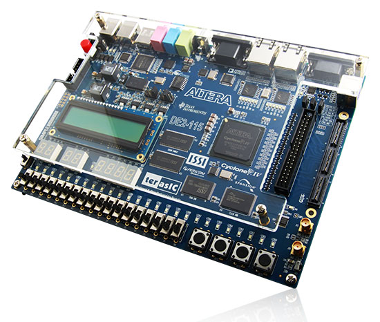

**Computer Vision**

Started in 2013, DE2-115 FPGA Board based computer vision project is
continuously improving since 2015 after completion of deliveries of 45
machines based on DE2-115 Boards to Indian Railways. This project was
meant to detect objects in x-ray images obtained in real time from x-ray
scanners. Though originally the project was for DE2--115 Boards only,
but as of now, the Anasim processor, the software and other related
IPCores can be ported to any FPGA platform and ASIC.

**DE2-115 FPGA Board:**

F{width="550"
height="466"} or more details on DE2--115 FPGA Board, please visit
[[<https://www.terasic.com.tw/cgi-bin/page/archive.pl?Language=English&No=502>]{.underline}]{lang="zxx"}

The project has several applications in the field of defence, robotics,
industrial and medical computer vision.

[]{#__DdeLink__73_1980708141}[]{#__DdeLink__50_2679174470} **We provide
time-limited non-commercial license for use of our Anasim Processor AI
IPCores (With runtime limited to 1 hour from device power-on) free of
cost for academic or non-commercial users who work on our Priyatoonz
repositories based open source projects. Please visit our github account
(**[[[**https://github.com/DSP-Channe**](https://github.com/DSP-Channel)]{.underline}]{lang="zxx"}[[[**l**](https://github.com/DSP-Channel)]{.underline}]{lang="zxx"}**)
for more details on Priyatoonz Open Source Projects. Contact at**
[[[**charu\@priyatooz.com**](mailto:charu@priyatooz.com)]{.underline}]{lang="zxx"}
**for commercial and the non-commercial licenses and AI IPCores
downloads and visit**
[[[**www.priyatoonz.com**](http://www.priyatoonz.com/)]{.underline}]{lang="zxx"}
**for more details. You may contact at**
[[[**cto\@anasim.in**](mailto:cto@anasim.in)]{.underline}]{lang="zxx"}
**for new Anasim Processor AI IPCores and Software Library related
development work.**
